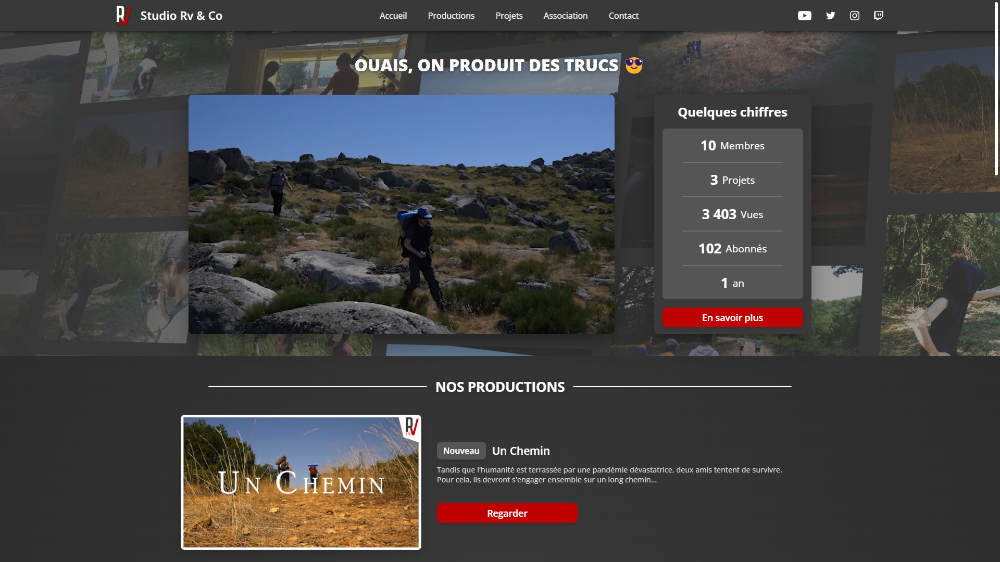

# [Rv & Co Website](https://rvandco.fr)
Website of the association Rv & Co promoting the productions and social networks.  

## Features
* Synchronization with the YouTube API
  * Retrieve statistics, playlists and videos
* Synchronization with the Instagram API
  * Retrieval of images published on the association's account
* Dynamic display of playlists
* Carousel for smaller projects
* Presentation of the association and its members
* 100% Responsive design
* Data in JSON format

## Dependencies
* [PHP 8.1](https://www.php.net/)
* [Crontab](https://en.wikipedia.org/wiki/Cron)

## Installation
### Config
The website stores and manages authentication tokens with the APIs. You will find an example of configuration in the file [config.ini.example](https://github.com/studiorvandco/Website/blob/v2/example/config.ini.example).

### Web server
The website is compatible with [Nginx](https://www.nginx.com/) and [Apache](https://httpd.apache.org/). You can find the Nginx server configuration in the file [vhost.example](https://github.com/studiorvandco/Website/blob/v2/example/vhost.example).

### Crontab
The website also requires the [Crontab](https://en.wikipedia.org/wiki/Cron) utility to allow automatic synchronization with the YouTube and Instagram APIs. You can find an example of configuration in the file [crontab.example](https://github.com/studiorvandco/Website/blob/v2/example/crontab.example).