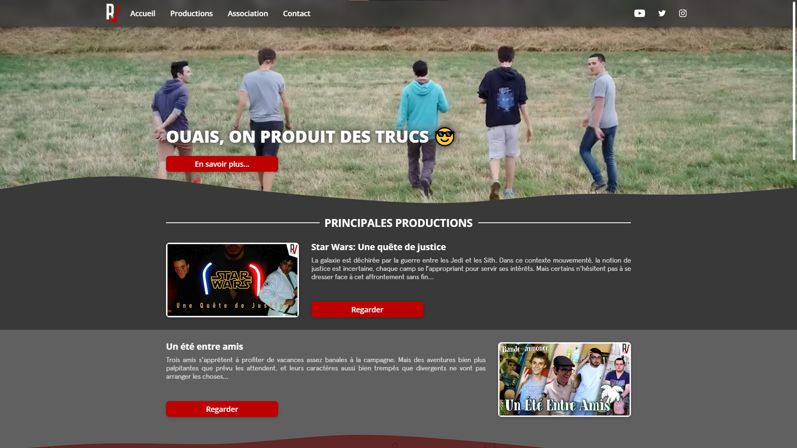

# [Rv & Co Website](https://rvandco.fr)
Website of the association Rv & Co promoting the productions and social networks.  


## Features
* Synchronization with the YouTube API
  * Retrieve statistics, playlists and videos
* Synchronization with the Instagram API
  * Retrieval of images published on the association's account
* Dynamic display of playlists
* Presentation of the association and its members
* Contact form integrated into the site
* Multilingual (French and English)
* 100% Responsive design
* Data in JSON format

## Dependencies
* [VueJS](https://vuejs.org/)
* [PHP 7](https://www.php.net/)
* [SendMail](https://en.wikipedia.org/wiki/Sendmail)
* [Crontab](https://en.wikipedia.org/wiki/Cron)
* [Python 3](https://www.python.org/)

## Installation
### Web server
The website is compatible with [Nginx](https://www.nginx.com/) and [Apache](https://httpd.apache.org/). You can find the Nginx server configuration in the file [nginx_vhost.txt](https://github.com/studiorvandco/Website/blob/main/src/assets/data_example/nginx_vhost.txt).

### Crontab
The website also requires the [Crontab](https://en.wikipedia.org/wiki/Cron) utility to allow automatic synchronization with the Youtube and Instagram APIs. You can find an example of configuration in the file [sync.py](https://github.com/studiorvandco/Website/blob/main/src/assets/data_example/sync.py).

### VueJS
The project works with the [VueJS](https://vuejs.org/) framework which itself uses dependencies from the [package.json](https://github.com/studiorvandco/Website/blob/main/package.json) file. These dependencies **must be installed** with this command :
```
npm install
```
Once the installation of the dependencies is finished, the website can be launched with the command :
```
npm run serve
```
### Compiles and minifies for production
Finally, it is possible to compile the framework files to improve the execution speed of the website. To do this, you need to run this command :
```
npm run build
```